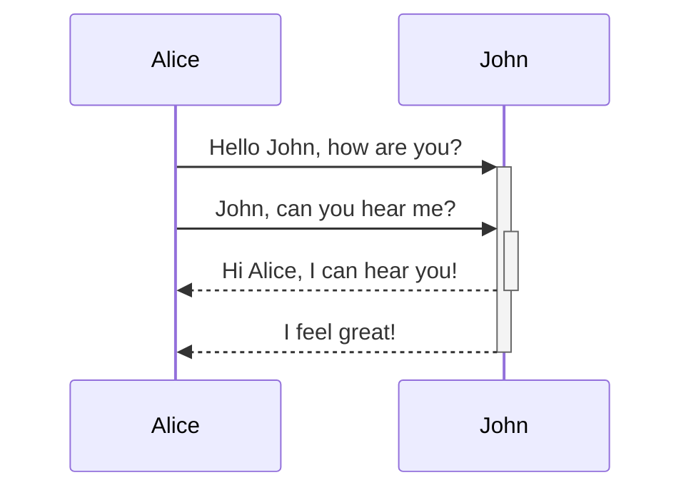
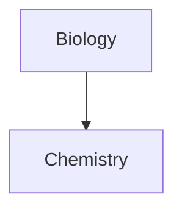

This is a paragraph.

This is another paragraph.

---
# This is a heading 1
## This is a heading 2
### This is a heading 3
#### This is a heading 4
##### This is a heading 5
###### This is a heading 6

---

**Bold**

_Italic_

~~Strikethrough~~

==Highlight==

**Bold and _nested_ italic**

***Bold and italic***

---

[[Classification du savoir et des recettes en pâtisserie]]

[Lien externe](https://google.com)


<span class="w-20 h-1"></span>

---


> Human beings face ever more complex and urgent problems, and their effectiveness in dealing with these problems is a matter that is critical to the stability and continued progress of society.

\- Doug Engelbart, 1961

> [!info]
> Human beings face ever more complex and urgent problems, and their effectiveness in dealing with these problems is a matter that is critical to the stability and continued progress of society.

> [!important]
> Human beings face ever more complex and urgent problems, and their effectiveness in dealing with these problems is a matter that is critical to the stability and continued progress of society.

> [!tip]
> Human beings face ever more complex and urgent problems, and their effectiveness in dealing with these problems is a matter that is critical to the stability and continued progress of society.

> [!success]
> Human beings face ever more complex and urgent problems, and their effectiveness in dealing with these problems is a matter that is critical to the stability and continued progress of society.

> [!question]
> Human beings face ever more complex and urgent problems, and their effectiveness in dealing with these problems is a matter that is critical to the stability and continued progress of society.

> [!warning]
> Human beings face ever more complex and urgent problems, and their effectiveness in dealing with these problems is a matter that is critical to the stability and continued progress of society.

> [!example]
> Human beings face ever more complex and urgent problems, and their effectiveness in dealing with these problems is a matter that is critical to the stability and continued progress of society.

> [!quote]
> Human beings face ever more complex and urgent problems, and their effectiveness in dealing with these problems is a matter that is critical to the stability and continued progress of society.

> [!nested]
> Human beings face ever more complex and urgent problems, and their effectiveness in dealing with these problems is a matter that is critical to the stability and continued progress of society.
> > [!warning]
> Human beings face ever more complex and urgent problems, and their effectiveness in dealing with these problems is a matter that is critical to the stability and continued progress of society.

---

- First list item
- Second list item
- Third list item

1. First list item
2. Second list item
3. Third list item

4. First list item
5. Second list item
6. Third list item

- [x] This is a completed task.
- [?] This is an incomplete task.
- [-] This is an incomplete task.

1. First list item
   2. Ordered nested list item
3. Second list item
   - Unordered nested list item

- [x] Task item 1
	- [ ] Subtask 1
- [ ] Task item 2
	- [x] Subtask 1

***
****
* * *
---
----
- - -
___
____
_ _ _

Text inside `backticks` on a line will be formatted like code.

```
cd ~/Desktop
```

	cd ~/Desktop

```js
function fancyAlert(arg) {
  if(arg) {
    $.facebox({div:'#foo'})
  }
}
```

--- 

You can also use inline footnotes. ^[This is an inline footnote.]

This is a simple footnote[^1].

[^1]: This is the referenced text.
[^2]: Add 2 spaces at the start of each new line.
  This lets you write footnotes that span multiple lines.
[^note]: Named footnotes still appear as numbers, but can make it easier to identify and link references.

---

This is an %%inline%% comment.

%%
This is a block comment.

Block comments can span multiple lines.
%%

--- 

\*This text will not be italicized\*.

# Advanced

| First name | Last name |
| ---------- | --------- |
| Max        | Planck    |
| Marie      | Curie     

---





$$
\begin{vmatrix}a & b\\
c & d
\end{vmatrix}=ad-bc
$$

This is an inline math expression $e^{2i\pi} = 1$.

---
THE END